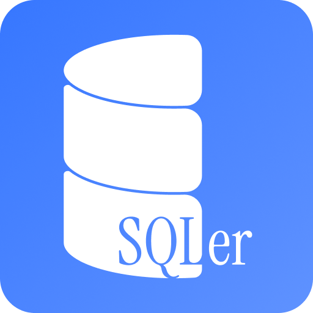

# SQLer - Intelligent SQL Autocomplete for PHP

<p align="center">
  
</p>

**SQLer** provides state-of-the-art, intelligent SQL autocomplete, rich hover information, formatting, interactive query execution, and schema diagnostics directly inside PHP string literals for MySQL and MariaDB databases.

---

## Key Features

- **Multi-Server & Multi-Database Connections**: Configure multiple database connections natively in VS Code settings UI using `sqler.connections`.
- **PHP AST SQL Detection**: Automatically detects SQL statements inside PHP string literals, heredocs, and nowdocs (`SELECT`, `INSERT`, `UPDATE`, `DELETE`, `REPLACE`, `CREATE`, `ALTER`, `DROP`, `TRUNCATE`, `WITH`).
- **Context-Aware Completion & Priority Sorting**:
  - **Priority Sorting**: Columns & Aliases appear at the top, followed by Tables, MySQL Functions, and SQL Keywords at the bottom.
  - **Function Snippets**: Complete arguments for `AVG()`, `COUNT()`, `SUM()`, `GROUP_CONCAT()`, `JSON_TABLE()`, `ROW_NUMBER() OVER()`, etc.
  - **Smart Context**: Offers `AS`, `,`, or `FROM` after closing function parentheses.
  - **WHERE Operator Context**: Suppresses column suggestions and suggests comparison operators (`=`, `<>`, `!=`, `IN`, `BETWEEN`, `LIKE`, `IS NULL`) immediately following a column.
  - **ON Clause FK Auto-Join**: Automatically suggests equality join conditions based on foreign key relationships between active tables.
- **Rich Tiered Hover Documentation**:
  - Compact TypeScript/PHP style signature header on top.
  - Hovering over SQL keywords or functions displays clear explanations and generic English usage examples.
  - Hovering over a table or alias (e.g. `u.` $\rightarrow$ `Uczestnik`) displays columns count, data types, primary keys, foreign key references, and comments.
  - Variable placeholders (`:id`, `$var`) are cleanly ignored.
- **Live Diagnostics & Security**:
  - Highlights unknown tables, unknown columns, and invalid aliases directly inside your PHP code.
  - **SQL Injection Warning Linter**: Alerts on unsafe variable concatenation inside SQL strings.
- **Quick Fixes 💡**: Press `Ctrl+.` on misspelled table or column names to auto-correct them via fuzzy string matching.
- **SQL Formatting (`SQLer: Format SQL Query`)**: Formats SQL clauses and indents code cleanly in PHP strings.
- **Interactive Execution (`▶ Run SQL Query`)**: Click CodeLens to run queries on your DB and preview results in a live HTML table view.

---

## Configuration

Configure your database connections under **VS Code Settings** $\rightarrow$ **SQLer Database Settings**:

```json
{
  "sqler.connections": [
    {
      "name": "Localhost / Production DB",
      "host": "localhost",
      "port": 3306,
      "driver": "mysql",
      "database": "my_database",
      "username": "root",
      "password": ""
    }
  ],
  "sqler.combineSameColumns": false
}
```

---

## Commands

* **`SQLer: Refresh Database Schema`** (`sqler.refreshSchema`): Reloads schema metadata across all configured servers and databases.
* **`SQLer: Format SQL Query`** (`sqler.formatQuery`): Formats SQL statement with proper indentation and line breaks.
* **`SQLer: Run SQL Query`** (`sqler.executeQuery`): Executes selected or active SQL query against configured database connection.
